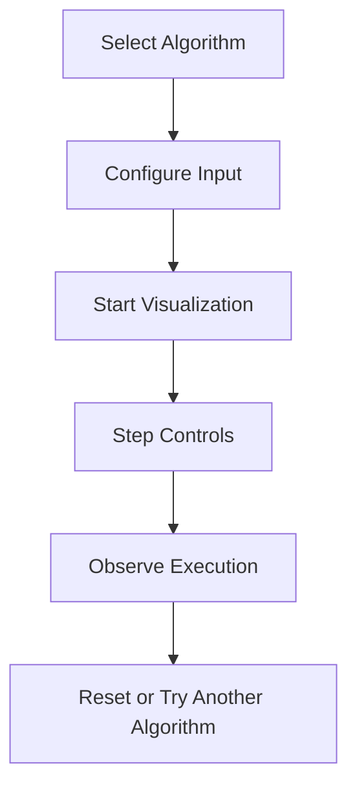
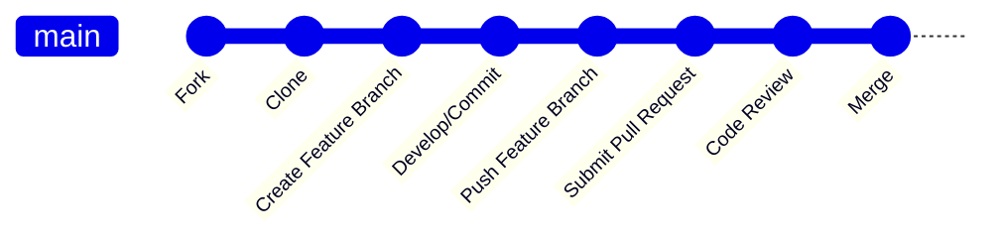

# AlgoViz

AlgoViz is a comprehensive platform for visualizing, learning, and interacting with algorithms. Designed for students, educators, and enthusiasts, AlgoViz offers intuitive visualizations of core data structures and algorithms, making complex concepts more accessible. With a well-structured interface and rich animation support, it provides hands-on experience to deepen your understanding of algorithmic logic and computational thinking.

## Features

- Interactive visualizations for fundamental algorithms (searching, sorting, graph traversal, and more).
- Step-by-step execution and animation controls (play, pause, next, previous).
- Real-time code highlighting for better learning.
- Support for multiple data structures, including arrays, stacks, queues, linked lists, trees, and graphs.
- User-friendly interface with options to customize input and execution speed.
- Modular and extensible design to add new algorithms easily.
- Responsive layout for desktop and mobile devices.

## Requirements

Before installing or running AlgoViz, ensure your development environment meets the following requirements:

- Node.js (version 14 or later)
- npm or yarn package manager
- Modern web browser (Chrome, Firefox, Safari, or Edge)
- Git (for cloning the repository)

## Installation

Follow these steps to set up AlgoViz on your local machine:

1. **Clone the repository:**

   ```bash
   git clone https://github.com/2003Mohammed/AlgoViz.git
   cd AlgoViz
   ```

2. **Install dependencies:**

   Using npm:

   ```bash
   npm install
   ```

   Or using yarn:

   ```bash
   yarn install
   ```

3. **Start the development server:**

   ```bash
   npm start
   ```

   Or with yarn:

   ```bash
   yarn start
   ```

4. **Open your browser and navigate to:**

   ```
   http://localhost:3000
   ```

## Usage

Once the application is running, you can interact with various algorithm visualizations:

- Select an algorithm from the main menu.
- Customize the input data as needed.
- Use the control panel to step through the algorithm:
  - Play/Pause the animation.
  - Move to the next or previous step.
  - Adjust the animation speed.
- Observe real-time updates in the visualization and code panel.

### Example Flow



## Configuration

AlgoViz can be customized to enhance your learning experience:

- **Animation Speed:** Adjust the slider to change execution speed.
- **Input Data:** Enter custom values for algorithms that require user input (e.g., array elements).
- **Theme:** Toggle between light and dark modes for visual comfort.
- **Language:** (If supported) Switch code display between supported programming languages.
- **Extending Algorithms:** Add new algorithms by following the project’s modular structure and contributing guidelines.

## Contributing

Contributions are welcome! To contribute:

- Fork the repository and create your feature branch.
- Follow the existing code style and project structure.
- Write clear, concise commit messages.
- Test your changes thoroughly.
- Submit a pull request describing your changes in detail.

### Contribution Workflow



## License

This project is licensed under the MIT License.

---

**MIT License**

Permission is hereby granted, free of charge, to any person obtaining a copy  
of this software and associated documentation files (the "Software"), to deal  
in the Software without restriction, including without limitation the rights  
to use, copy, modify, merge, publish, distribute, sublicense, and/or sell  
copies of the Software, and to permit persons to whom the Software is  
furnished to do so, subject to the following conditions:

The above copyright notice and this permission notice shall be included in all  
copies or substantial portions of the Software.

THE SOFTWARE IS PROVIDED "AS IS", WITHOUT WARRANTY OF ANY KIND, EXPRESS OR  
IMPLIED, INCLUDING BUT NOT LIMITED TO THE WARRANTIES OF MERCHANTABILITY,  
FITNESS FOR A PARTICULAR PURPOSE AND NONINFRINGEMENT. IN NO EVENT SHALL THE  
AUTHORS OR COPYRIGHT HOLDERS BE LIABLE FOR ANY CLAIM, DAMAGES OR OTHER  
LIABILITY, WHETHER IN AN ACTION OF CONTRACT, TORT OR OTHERWISE, ARISING FROM,  
OUT OF OR IN CONNECTION WITH THE SOFTWARE OR THE USE OR OTHER DEALINGS IN THE  
SOFTWARE.
